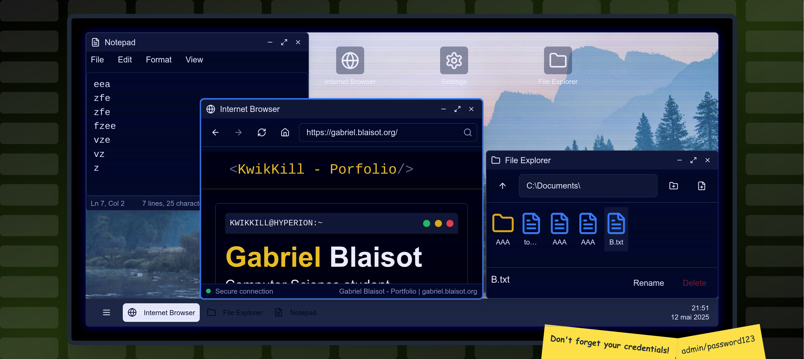

# Talos

Talos is a virtual OS simulation project built with React.
It is designed to provide a simple and interactive interface that mimics the functionality of a real operating system.

## Features
- Boot sequence with a loading screen.
- Login screen with a password prompt.
- Desktop interface with a taskbar and start menu.
- File explorer with basic file operations (create, delete, rename).
- Text editor for creating and editing text files.
- Basic calculator for performing arithmetic operations.
- Simple game (Tetris) for entertainment.
- Customizable wallpaper and settings.
- Fake Browser with limited functionality.

## Author

This project was created by [KwikKill](https://github.com/KwikKill) as a personal project to learn and practice React. This project is open-source.
